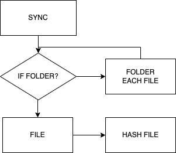

# Simple indexed files

File indexing. This package looks for new or changed files.

> Author: [Alexey Vlasov](https://github.com/adideas)

## Example indexed system

| N   | hash file (Long)    | ??? | name file    | content | action                        |
|-----|---------------------|-----|--------------|---------|-------------------------------|
| 0   | 100626589366322420  | OK  | test.txt     | 123     | No action                     |
| 1   | 3122351599266268404 |     | test1.txt    | 123     | Rename file or move file      |
| 2   | 100626589366322420  | OK  | test.txt     | 123     | Rollback file (rename / move) |
| 3   | -26840431223515992  |     | ren/test.txt | 123     | Rename file or move file      |
| 4   | 100626589366322420  | OK  | test.txt     | 123     | Rollback file (rename / move) |
| 5   | 100626590308491587  |     | test.txt     | 13214   | Update file                   |

## Hash Long
```
Long.BYTES = (-2 ^ 63 <-> +2 ^ 63)
Long.BYTES = (-9`223`372`036`854`775`807 <-> +9`223`372`036`854`775`807)
```

## Block Schema


## Use
```java
public class Main {
    public static void main(String[] args) {
        BindFilesystem.sync(Path.of("/to_folder"), this::store, this::sendFile);
    }
    
    private Boolean sendFile(File file) {
        // Send file
        // if file send return true;
        // else return false;
    }
    
    private Boolean store(boolean isCheck, Long hash) {
        if (isCheck) {
            // check exist in store
        } else {
            // add to store
        }
    }
}
```